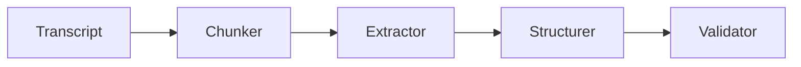

# Autonomous Meeting Intelligence

LLM-powered structured transcript understanding pipeline.

## Architecture

## Pipeline
transcript → chunk → extract → structure → validate

### Highlights
schema validation, 
structured extraction and 
modular NLP pipeline.

## License
MIT
