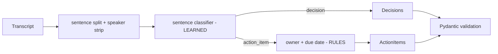

# Autonomous Meeting Intelligence

Transcript understanding: a **fitted sentence classifier** separates decisions
and action items from ordinary discussion, and rule-based slot extraction pulls
the owner and due date out of each action item. Output is validated against a
Pydantic schema.

> **The served classifier is trained on synthetic data**, generated by
> `training/generate_transcripts.py` (seeded and reproducible), not real meeting
> transcripts. Those metrics are real measurements on a held-out split.
>
> **The same pipeline is separately validated on real meetings** — the
> [AMI Meeting Corpus](https://groups.inf.ed.ac.uk/ami/corpus/), 137 recorded
> meetings with human-annotated decisions and action items. **It performs poorly
> there**: positive-class macro-F1 0.1799. That result is published rather than
> buried: see [Validation on real data](#validation-on-real-data).

## What is learned and what is not

| Stage | Implementation | Why |
|---|---|---|
| Sentence classification | **Learned** — TF-IDF (word + char n-grams) → LogisticRegression | Recognising a decision phrased as *"that settles it"* is not a pattern-matching problem |
| Owner extraction | **Rules** — role-anchored patterns | Slot filling from an already-classified sentence; patterns are a reasonable tool |
| Due-date extraction | **Rules** — date expression patterns | Same |

The rules are not the problem the previous version had. The problem was that
nothing measured whether they worked. They are now scored against gold slots, and
**the scores are not flattering** — see below.

## Results

Evaluated on **held-out templates**: 18 whole phrasings are removed from training,
so every test sentence is worded in a way the classifier has never seen.

### Sentence classification (n=776)

| Class | Precision | Recall | F1 | Support |
|---|---|---|---|---|
| `action_item` | 0.42 | **0.99** | 0.59 | 155 |
| `decision` | 0.47 | 0.82 | 0.60 | 93 |
| `neither` | **0.93** | 0.43 | 0.59 | 528 |

**Macro-F1 0.5894**, against **0.3235** for the keyword gate this replaced —
scored on the same held-out data, so the improvement is measured rather than
asserted.

The classifier is clearly **recall-biased**: it catches 99% of action items and
82% of decisions, at the cost of flagging a lot of ordinary discussion
(`neither` recall 0.43). For a meeting-notes assistant that is the defensible
direction — missing a commitment someone made is worse than surfacing a candidate
a human dismisses — but it is a real precision cost and is stated rather than
buried.

### Why the keyword gate scored so badly

It required `"action:"`, `"follow up"`, `"will"` or `"todo"` for an action item,
and `"decision:"` or `"decided to"` for a decision. In this corpus only **3.9%**
of decisions carry an explicit `"Decision:"` marker, so it misses almost all of
them — while firing on *"I will grab a coffee"*.

### Slot extraction (rule-based, scored on true action items)

| Slot | Precision | Recall | F1 |
|---|---|---|---|
| Owner | 0.5745 | **0.3484** | 0.4337 |
| Due date | **1.0000** | 0.7160 | 0.8345 |

**Owner recall of 0.35 is poor, and that is the honest number.** The patterns
anchor on capitalised first names and miss full names, titles and team references
(*"the platform team"*, *"Dr. Chen"*, *"someone from finance"*). Due-date
extraction is perfectly precise but misses 28% — the unusual forms
(*"before the audit"*, *"3rd of June"*, *"once legal signs off"*).

An earlier version of this corpus scored **1.0 / 1.0** on both slots. That was not
a good result; it only demonstrated that the patterns and the generator had been
written by the same hand. Surface forms the rules do not handle were added
deliberately, and a test now asserts the scores stay below 0.95.

Full details: [`models/artifacts/model_card.md`](models/artifacts/model_card.md).

## Validation on real data

Held-out templates keep the synthetic evaluation honest about *phrasing*. What
they cannot reproduce is the shape of a real meeting: decisions emerge over
several turns of ordinary talk, surrounded by chatter that looks identical.

This track runs the same pipeline against the [AMI Meeting Corpus](https://groups.inf.ed.ac.uk/ami/corpus/)
(CC BY 4.0) — 137 real recorded meetings.

```bash
python training/fetch_real_data.py
python training/train_real.py
```

Only the manual annotations are downloaded (23MB). The full corpus with audio and
video is ~100GB and is not needed for a text task.

### How the labels were built

AMI doesn't ship this dataset; it ships the parts. `words/` gives the transcript,
`dialogueActs/` the utterance boundaries, `abstractive/` human summaries under
explicit **DECISIONS** and **ACTIONS** headings, and `extractive/summlink.xml`
links each summary sentence back to the dialogue acts supporting it.

A dialogue act linked under DECISIONS is a decision; under ACTIONS an action item;
everything else `neither`. **The labels come from annotators summarising a meeting,
with no classifier in mind** — which is exactly what the synthetic corpus cannot
offer, since there the labels and the data come from the same generator.

### The honest headline: it finds real decisions badly

| | Fitted | Keyword extractor |
|---|---|---|
| **Positive-class macro-F1** | **0.1799** | 0.0244 |
| `decision` F1 | 0.1417 | — |
| `action_item` F1 | 0.2182 | — |
| 3-class macro-F1 | 0.4462 | 0.3438 |

Two true things, and both belong here:

**It beats the keyword extractor by roughly 7×** on the classes that matter. That
is the claim being made, and the data supports it.

**In absolute terms it is weak.** It recovers about 21% of decisions, and when it
flags one it is right about 11% of the time.

The three-class macro-F1 of 0.4462 is *not* the headline, deliberately. It
averages in `neither` at 0.9787 — a class that is 98% of the data and trivially
easy — which lifts a model scoring 0.14 on decisions into respectable-looking
territory. A test asserts the positive-class figure stays the headline.

### Why this is so much lower than 0.5894 synthetic

Both are real measurements of different difficulties. In the generated corpus a
decision is one sentence built from a decision template and the classes are
near-balanced. In a real meeting **1.6%** of utterances carry a decision or action
item, and the sentence that settles one is lexically indistinguishable from the
twenty around it.

A sparse bag of n-grams has very little to work with. That is a limit of the
representation, not a bug — closing it means sentence embeddings with surrounding
context, not tuning this model.

### Construction notes

- The split is by **meeting**, not utterance: two utterances from one meeting
  share topic, participants and vocabulary, so a row split would let the model
  recognise the meeting rather than the decision.
- 10 utterances were linked to both a decision and an action item. Real, but not
  representable in a 3-class scheme, so they are dropped and counted.
- 5 summarised meetings ship no `summlink` file; every utterance would default to
  `neither`, so they are excluded rather than added as thousands of false
  negatives.

Full details: [`models/artifacts/real/model_card.md`](models/artifacts/real/model_card.md).

## Pipeline


```mermaid
flowchart LR
  Transcript --> Split[sentence split + speaker strip]
  Split --> Classifier[sentence classifier - LEARNED]
  Classifier -->|decision| Decisions
  Classifier -->|action_item| Slots[owner + due date - RULES]
  Slots --> ActionItems
  Decisions --> Schema[Pydantic validation]
  ActionItems --> Schema
```

## API

- `GET /health` — status plus the identity of the loaded classifier
- `GET /metrics`
- `GET /events` protected when `API_KEY` is set
- `POST /analyze`

```json
{
  "transcript": "Ravi: morning everyone.\nMaya: we agreed to move forward with the beta launch.\nPriya will send the notes on the rollout by Friday."
}
```

Set `API_KEY` to require `X-API-Key` on analysis/event endpoints.
Set `APP_DB_PATH` to control the SQLite event database location.

## Optional LLM backend

Sentence classification can run through an LLM instead. No vendor is hardcoded:

```
LLM_PROVIDER   openai_compatible | anthropic | none   (default: none)
LLM_API_KEY    your key
LLM_MODEL      model identifier
LLM_BASE_URL   endpoint override (self-hosted, gateways, Ollama, vLLM)
```

Default is `none`. **Every metric above comes from the fitted classifier path.**

## Run

```bash
pip install -r requirements.txt
python -m pytest -q
python evaluation/evaluate.py
uvicorn api.server:app --reload --port 8000
```

Artifacts are committed, so the service runs on a fresh clone. To regenerate:

```bash
python training/generate_transcripts.py
python training/train.py
```

To confirm the committed transcripts and classifier are reproducible — this is
what CI runs:

```bash
python training/generate_transcripts.py --check
python training/train.py --verify
```

With the server running, use a second terminal:

```bash
python scripts/smoke_test.py
```

Docker:

```bash
cp .env.example .env
docker compose up --build
```

Kubernetes manifests live in `k8s/deployment.yaml` and include probes, resource
limits, a Service, and a PVC for the SQLite event store.

## Cross-service integration (optional)

Extracted decisions and action items can be published to the retrieval service so
they become searchable:

```
RAG_API_URL          retrieval service base URL
INTEGRATION_API_KEY  X-API-Key, when it requires one
PUBLISH_TO_RAG=0     disable publishing while still configured
```

A decision recorded in a meeting is exactly the thing someone later searches for
and cannot find. Indexing it makes *"what did we decide about the migration
plan?"* answerable from the same endpoint that answers policy questions. Owners
and due dates are kept inline, because "who owns it" is the follow-up question.

Unset `RAG_API_URL` and analysis behaves exactly as documented above. Publishing
is non-blocking: if retrieval is down, the analysis still returns and the response
says the publish did not happen. Meetings with no decisions and no action items
are never published — indexing chatter would pollute the corpus for everyone.

## Reviewer Status

**What is real and independently checkable:**

- A fitted three-class sentence classifier, beating the keyword gate it replaced
  by a **measured** margin on held-out data (0.5894 vs 0.3235). A test asserts it.
- **Held-out-template evaluation**, with a test asserting train and test share no
  template.
- Real per-class precision/recall/F1, replacing a "structure_accuracy" metric that
  compared `len(action_items) >= expected` — returning every sentence would have
  scored 100%.
- Slot extraction measured against gold, including where it fails badly.
- A test asserting the slot scores are **not** suspiciously perfect.
- Pydantic schema validation on every response.
- Transcripts and training reproducible, verified in CI.

**What is explicitly not real:**

- **The served classifier's data is synthetic** and template-generated. Real
  transcripts carry ASR errors, interruptions, crosstalk and unfinished sentences;
  none appear here. The pipeline is validated on real meetings
  ([above](#validation-on-real-data)) — and scores 0.1799 there, which is the
  honest measure of how far the synthetic figure generalises.
- Sentences are classified independently, with no discourse context — so
  *"that's approved then"* is judged without knowing what "that" refers to.
- One label per sentence: a sentence that records a decision *and* assigns an
  owner gets one class.
- Due dates are surface strings (*"Friday"*, *"EOD"*), never resolved to calendar
  dates — that needs the meeting date and a timezone.
- Owner extraction handles capitalised first names only. No surnames, no
  disambiguation, no mapping to directory identities.
- No speaker diarisation, no audio ingestion, no calendar integration.
- The SQLite event store is an audit trail for demos, not a production system.
- Docker/Compose/Kubernetes config is validated by static inspection and CI image
  builds; **cloud deployment is pending and unverified**.

**Shared scaffolding:** HTTP hardening (`utils/security.py`), the event store
(`utils/storage.py`) and the metrics surface follow a common service template
shared with the other Python services in this portfolio. That is deliberate reuse.

**Portfolio index:** https://github.com/Adityansh-Chand/ai-engineering-portfolio

## Highlights

- Fitted sentence classifier that finds decisions with no explicit marker — 96%
  of the decisions in this corpus have none.
- The replaced keyword gate scored on the same data, so the gain is a measured
  delta rather than a claim.
- Held-out-template evaluation measuring generalisation, not memorisation.
- Rule-based slots that are measured and reported honestly, including a 0.35
  owner recall.
- A test that fails if slot extraction ever looks suspiciously perfect again.
- Summaries that describe what was recorded rather than echoing the first line.
- Provider-agnostic optional LLM backend that no reported metric depends on.

## License

MIT
