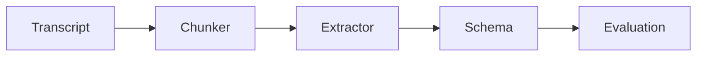

# Autonomous Meeting Intelligence

Transcript understanding service that chunks meeting text, extracts decisions
and action items, and validates the output against a structured schema.

## Pipeline


```mermaid
flowchart LR
  Transcript --> Chunker
  Chunker --> Extractor
  Extractor --> Schema
  Schema --> Evaluation
```

## API

- `GET /health`
- `GET /metrics`
- `GET /events` protected when `API_KEY` is set
- `POST /analyze`

Example:

```json
{
  "transcript": "Decision: approve launch. Priya will follow up with legal by Friday."
}
```

Set `API_KEY` to require `X-API-Key` on analysis/event endpoints.
Set `APP_DB_PATH` to control the SQLite event database location.

## Run

```bash
pip install -r requirements.txt
python -m pytest -q
python evaluation/evaluate.py
uvicorn api.server:app --reload --port 8000
```

Docker:

```bash
cp .env.example .env
docker compose up --build
```

Kubernetes manifests live in `k8s/deployment.yaml` and include probes, resource
limits, a Service, and a PVC for the SQLite event store.

## Highlights

- Speaker/transcript-friendly chunking.
- Decision extraction.
- Action item extraction with owner and due date.
- Pydantic schema validation.
- Structure evaluation over sample transcripts.
- SQLite event audit trail for analysis metadata.
- GitHub Actions CI for tests, eval, and container build.
- Production data contract in `datasets/production_schema.json`.

## License

MIT
