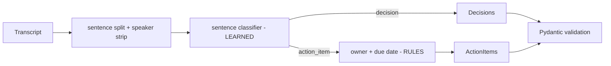

# Autonomous Meeting Intelligence

Transcript understanding: a **fitted sentence classifier** separates decisions
and action items from ordinary discussion, and rule-based slot extraction pulls
the owner and due date out of each action item. Output is validated against a
Pydantic schema.

> **Training data is synthetic.** It is generated by
> `training/generate_transcripts.py` (seeded and reproducible), not real meeting
> transcripts. The metrics below are real measurements on a held-out split, not
> evidence of real-world performance.

## What is learned and what is not

| Stage | Implementation | Why |
|---|---|---|
| Sentence classification | **Learned** — TF-IDF (word + char n-grams) → LogisticRegression | Recognising a decision phrased as *"that settles it"* is not a pattern-matching problem |
| Owner extraction | **Rules** — role-anchored patterns | Slot filling from an already-classified sentence; patterns are a reasonable tool |
| Due-date extraction | **Rules** — date expression patterns | Same |

The rules are not the problem the previous version had. The problem was that
nothing measured whether they worked. They are now scored against gold slots, and
**the scores are not flattering** — see below.

## Results

Evaluated on **held-out templates**: 18 whole phrasings are removed from training,
so every test sentence is worded in a way the classifier has never seen.

### Sentence classification (n=776)

| Class | Precision | Recall | F1 | Support |
|---|---|---|---|---|
| `action_item` | 0.42 | **0.99** | 0.59 | 155 |
| `decision` | 0.47 | 0.82 | 0.60 | 93 |
| `neither` | **0.93** | 0.43 | 0.59 | 528 |

**Macro-F1 0.5894**, against **0.3235** for the keyword gate this replaced —
scored on the same held-out data, so the improvement is measured rather than
asserted.

The classifier is clearly **recall-biased**: it catches 99% of action items and
82% of decisions, at the cost of flagging a lot of ordinary discussion
(`neither` recall 0.43). For a meeting-notes assistant that is the defensible
direction — missing a commitment someone made is worse than surfacing a candidate
a human dismisses — but it is a real precision cost and is stated rather than
buried.

### Why the keyword gate scored so badly

It required `"action:"`, `"follow up"`, `"will"` or `"todo"` for an action item,
and `"decision:"` or `"decided to"` for a decision. In this corpus only **3.9%**
of decisions carry an explicit `"Decision:"` marker, so it misses almost all of
them — while firing on *"I will grab a coffee"*.

### Slot extraction (rule-based, scored on true action items)

| Slot | Precision | Recall | F1 |
|---|---|---|---|
| Owner | 0.5745 | **0.3484** | 0.4337 |
| Due date | **1.0000** | 0.7160 | 0.8345 |

**Owner recall of 0.35 is poor, and that is the honest number.** The patterns
anchor on capitalised first names and miss full names, titles and team references
(*"the platform team"*, *"Dr. Chen"*, *"someone from finance"*). Due-date
extraction is perfectly precise but misses 28% — the unusual forms
(*"before the audit"*, *"3rd of June"*, *"once legal signs off"*).

An earlier version of this corpus scored **1.0 / 1.0** on both slots. That was not
a good result; it only demonstrated that the patterns and the generator had been
written by the same hand. Surface forms the rules do not handle were added
deliberately, and a test now asserts the scores stay below 0.95.

Full details: [`models/artifacts/model_card.md`](models/artifacts/model_card.md).

## Pipeline


```mermaid
flowchart LR
  Transcript --> Split[sentence split + speaker strip]
  Split --> Classifier[sentence classifier - LEARNED]
  Classifier -->|decision| Decisions
  Classifier -->|action_item| Slots[owner + due date - RULES]
  Slots --> ActionItems
  Decisions --> Schema[Pydantic validation]
  ActionItems --> Schema
```

## API

- `GET /health` — status plus the identity of the loaded classifier
- `GET /metrics`
- `GET /events` protected when `API_KEY` is set
- `POST /analyze`

```json
{
  "transcript": "Ravi: morning everyone.\nMaya: we agreed to move forward with the beta launch.\nPriya will send the notes on the rollout by Friday."
}
```

Set `API_KEY` to require `X-API-Key` on analysis/event endpoints.
Set `APP_DB_PATH` to control the SQLite event database location.

## Optional LLM backend

Sentence classification can run through an LLM instead. No vendor is hardcoded:

```
LLM_PROVIDER   openai_compatible | anthropic | none   (default: none)
LLM_API_KEY    your key
LLM_MODEL      model identifier
LLM_BASE_URL   endpoint override (self-hosted, gateways, Ollama, vLLM)
```

Default is `none`. **Every metric above comes from the fitted classifier path.**

## Run

```bash
pip install -r requirements.txt
python -m pytest -q
python evaluation/evaluate.py
uvicorn api.server:app --reload --port 8000
```

Artifacts are committed, so the service runs on a fresh clone. To regenerate:

```bash
python training/generate_transcripts.py
python training/train.py
```

To confirm the committed transcripts and classifier are reproducible — this is
what CI runs:

```bash
python training/generate_transcripts.py --check
python training/train.py --verify
```

With the server running, use a second terminal:

```bash
python scripts/smoke_test.py
```

Docker:

```bash
cp .env.example .env
docker compose up --build
```

Kubernetes manifests live in `k8s/deployment.yaml` and include probes, resource
limits, a Service, and a PVC for the SQLite event store.

## Reviewer Status

**What is real and independently checkable:**

- A fitted three-class sentence classifier, beating the keyword gate it replaced
  by a **measured** margin on held-out data (0.5894 vs 0.3235). A test asserts it.
- **Held-out-template evaluation**, with a test asserting train and test share no
  template.
- Real per-class precision/recall/F1, replacing a "structure_accuracy" metric that
  compared `len(action_items) >= expected` — returning every sentence would have
  scored 100%.
- Slot extraction measured against gold, including where it fails badly.
- A test asserting the slot scores are **not** suspiciously perfect.
- Pydantic schema validation on every response.
- Transcripts and training reproducible, verified in CI.

**What is explicitly not real:**

- **The data is synthetic** and template-generated. Real transcripts carry ASR
  errors, interruptions, crosstalk and unfinished sentences; none appear here.
- Sentences are classified independently, with no discourse context — so
  *"that's approved then"* is judged without knowing what "that" refers to.
- One label per sentence: a sentence that records a decision *and* assigns an
  owner gets one class.
- Due dates are surface strings (*"Friday"*, *"EOD"*), never resolved to calendar
  dates — that needs the meeting date and a timezone.
- Owner extraction handles capitalised first names only. No surnames, no
  disambiguation, no mapping to directory identities.
- No speaker diarisation, no audio ingestion, no calendar integration.
- The SQLite event store is an audit trail for demos, not a production system.
- Docker/Compose/Kubernetes config is validated by static inspection and CI image
  builds; **cloud deployment is pending and unverified**.

**Shared scaffolding:** HTTP hardening (`utils/security.py`), the event store
(`utils/storage.py`) and the metrics surface follow a common service template
shared with the other Python services in this portfolio. That is deliberate reuse.

**Portfolio index:** https://github.com/Adityansh-Chand/ai-engineering-portfolio

## Highlights

- Fitted sentence classifier that finds decisions with no explicit marker — 96%
  of the decisions in this corpus have none.
- The replaced keyword gate scored on the same data, so the gain is a measured
  delta rather than a claim.
- Held-out-template evaluation measuring generalisation, not memorisation.
- Rule-based slots that are measured and reported honestly, including a 0.35
  owner recall.
- A test that fails if slot extraction ever looks suspiciously perfect again.
- Summaries that describe what was recorded rather than echoing the first line.
- Provider-agnostic optional LLM backend that no reported metric depends on.

## License

MIT
