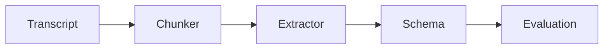

# Autonomous Meeting Intelligence

Transcript understanding service that chunks meeting text, extracts decisions
and action items, and validates the output against a structured schema.

## Pipeline


```mermaid
flowchart LR
  Transcript --> Chunker
  Chunker --> Extractor
  Extractor --> Schema
  Schema --> Evaluation
```

## API

- `GET /health`
- `POST /analyze`

Example:

```json
{
  "transcript": "Decision: approve launch. Priya will follow up with legal by Friday."
}
```

## Run

```bash
pip install -r requirements.txt
python -m pytest -q
python evaluation/evaluate.py
uvicorn api.server:app --reload --port 8000
```

## Highlights

- Speaker/transcript-friendly chunking.
- Decision extraction.
- Action item extraction with owner and due date.
- Pydantic schema validation.
- Structure evaluation over sample transcripts.

## License

MIT
